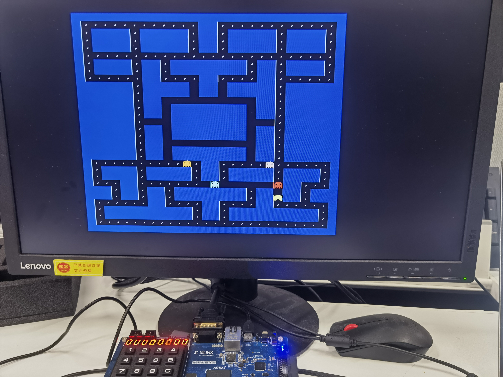
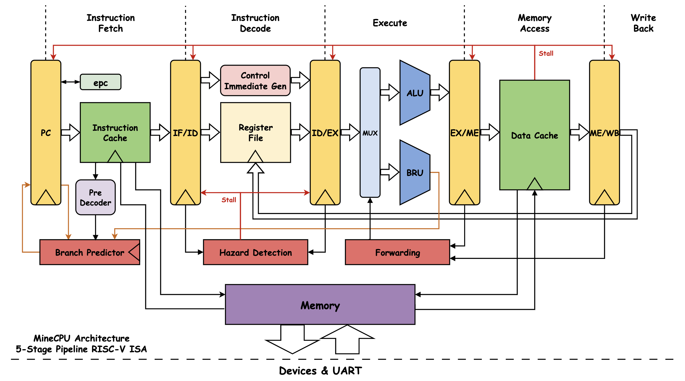
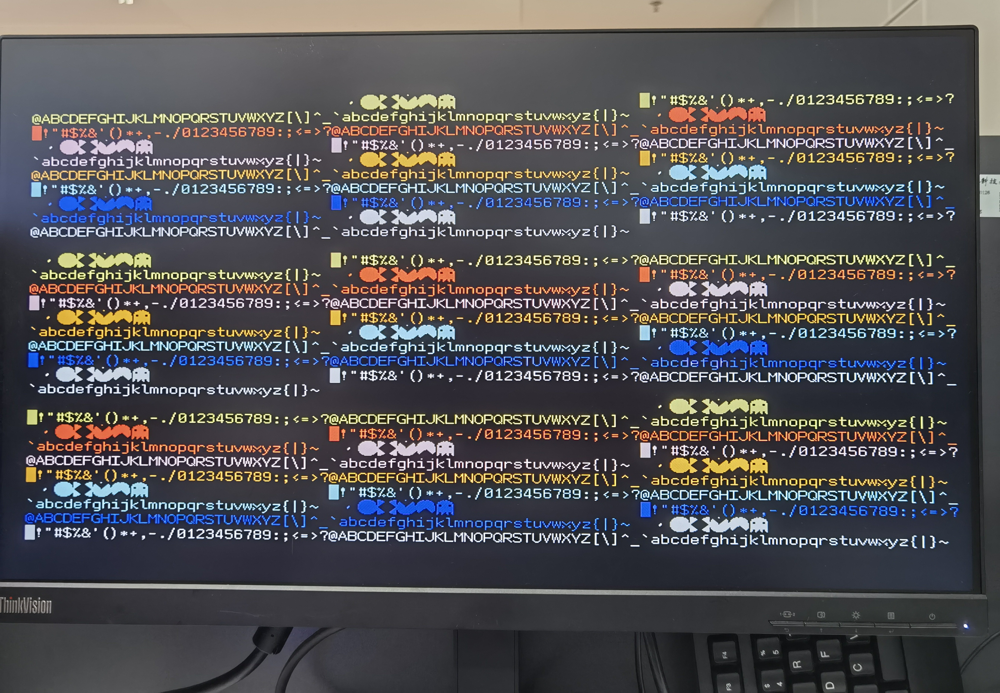

<div align=center>

# SUSTech CS202 Course Project: MineCPU

南方科技大学 2024 年春季 `CS202 计算机组成原理` 的课程 Project 

**支持 RISC-V ISA 的冯诺依曼架构含 Cache 和异常控制并附带手搓 UART 的标准五级 pipeline CPU**

**附带汇编版吃豆人代码，能够通过 UART 传输至 CPU 运行**

**HAVE FUN ! ! ! :satisfied:**

<div align="center">
    
</div>


</div>

## 小组成员及分工

| 成员 | CPU核心 | IO | 仿真 & 测试 | 汇编 & 应用 | 报告 |
| --- | --- | --- | --- | --- | --- |
| [@wLUOw](https://github.com/wLUOw) | :heavy_check_mark: |  | :heavy_check_mark: |  | :heavy_check_mark: |
| [@Yao1OoO](https://github.com/Yao1OoO) |  | :heavy_check_mark: |  | :heavy_check_mark: | :heavy_check_mark: |
| [@chanbengz](https://github.com/chanbengz) | :heavy_check_mark: |  | :heavy_check_mark: |  | :heavy_check_mark: |


## 项目结构

```
MineCPU
├── docs
│   ├── pic                     # pictures used
│   ├── Architecture.drawio     # design draft
│   ├── project_desciption.pdf  # project description
│   ├── Report.md               # report of this project
│   └── riscv-card.pdf          # ISA reference
├── generated
│   └── *.bit                   # bitstream file with different configurations
├── program
│   ├── lib                     # library of hardware API (driver)
│   ├── pacman                  # game by C++ (easier cross-compiling to RV)
│   └── testcase                # used for project presentation
├── sources
│   ├── assembly
│   │   ├── *.asm               # assembly code for test and fun
│   │   ├── *.coe               # hex version of machine code
│   │   └── *.txt               # data using UART to be put into memory            
│   ├── constrain
│   │   └── constr.xdc          # constrain file
│   ├── core
│   │   ├── *.sv                # code of CPU core
│   │   └── *.svh               # head file for constant
│   ├── io
│   │   └── *.sv                # code related to IO and Clock
│   ├── sim
│   │   ├── *.cpp               # verilator simulation
│   │   └── *.sv                # vivado simulation
│   └── Top.sv                  # top module of MineCPU
├── test
│   ├── DiffTest.cpp            # differential test of CPU
│   ├── *.sv                    # on-board-test code
│   └── *.xdc                   # on-board-test constrain
├── tools
│   ├── inst2txt.py             # instruction to text file for UART
│   ├── ecall2sv.py             # coe to code for burning into ROM
│   └── UARTAssist.exe          # tool for UART
├── .gitignore
├── LICENSE
└── README.md
```


## 完成列表

- [x] CPU 核心
  - [x] IF Stage
    - [x] 分支预测模块 (Branch Prediction) *
      - [x] 预解码 (Pre-Decode) *
      - [x] 分支历史缓存 (Branch History Table) *
      - [x] 返回地址栈 (Return Address Stack) *
    - [x] 指令缓存 (Instruction Cache) *
      - [x] 直接映射 (Direct Mapping) *
      - [ ] 预取指 (Pre-Fetch)
  - [x] ID Stage
    - [x] 立即数生成模块 (ImmGen)
    - [x] 寄存器模块 (Register File)
    - [x] 控制模块 (Control Unit)
    - [x] 数据冒险停顿模块 (Hazard Detection)
  - [x] EX Stage
    - [x] 算术逻辑 (ALU)
      - [x] RV32I
      - [x] RV32M *
    - [x] 分支判断 (BRU)
    - [x] 前递模块 (Forward Unit) *
  - [x] MEM Stage
    - [x] Byte / Halfword / Word 的存取
    - [x] 数据缓存 (Data Cache) *
      - [x] 直接映射 (Direct Mapping) *
      - [x] 写回策略 (Write Back) *
  - [x] WB Stage
  - [x] Memory
    - [x] MMIO
    - [x] 异常执行指令 (ROM)
  - [x] 异常控制 (ecall & sret) *
- [x] IO
  - [x] 拨码开关 & 按钮
  - [x] 4*4 小键盘 *
  - [x] Led & 7 段数码管
  - [x] UART *
  - [x] VGA *
- [ ] 软件
  - [x] 测试场景1
  - [ ] 测试场景2
  - [x] Pacman *


## 架构设计


Powered by [draw.io](https://app.diagrams.net/)


## 功能

### CPU

- **冯诺依曼架构**支持 **RISC-V** 指令集的**五级流水线** CPU
- 时钟频率:
  + CPU: 50MHz
  + MEM: 50MHz
  + VGA: 40MHz
- **分支预测**:
  + BHT: 32 entries, 2 bits
  + RAS: 32 entries, 32 bits
- **Cache**:
  + ICache: 直接映射, 1472 bits, 32 entries
  + DCache: 直接映射/写回, 1504 bits, 32 entries
- **异常控制**:
  + ecall: 外部设备驱动, 通过 MMIO 进行输入输出, API doc 见 [Environment Call](#environment-call)


### ISA

RISC-V 基本指令集 (RV32I) 及乘除法拓展 (RV32M)

| 指令                    | 指令类型  | 执行操作                                   |
| ---------------------- | -------- | ----------------------------------------- |
| `add rd, rs1, rs2`     | R        | rd = rs1 + rs2                            |
| `sub rd, rs1, rs2`     | R        | rd = rs1 - rs2                            |
| `xor rd, rs1, rs2`     | R        | rd = rs1 ^ rs2                            |
| `or rd, rs1, rs2`      | R        | rd = rs1 \| rs2                           |
| `and rd, rs1, rs2`     | R        | rd = rs1 & rs2                            |
| `sll rd, rs1, rs2`     | R        | rd = rs1 << rs2                           |
| `srl rd, rs1, rs2`     | R        | rd = rs1 >> rs2                           |
| `sra rd, rs1, rs2`     | R        | rd = rs1 >> rs2 (sign-extend)             |
| `slt rd, rs1, rs2`     | R        | rd = ( rs1 < rs2 ) ? 1 : 0                |
| `sltu rd, rs1, rs2`    | R        | rd = ( (u)rs1 < (u)rs2 ) ? 1 : 0          |
| `addi rd, rs1, rs2`    | I        | rd = rs1 + imm                            |
| `xori rd, rs1, rs2`    | I        | rd = rs1 ^ imm                            |
| `ori rd, rs1, rs2`     | I        | rd = rs1 \| imm                           |
| `andi rd, rs1, rs2`    | I        | rd = rs1 & imm                            |
| `slli rd, rs1, rs2`    | I        | rd = rs1 << imm[4:0]                      |
| `srli rd, rs1, rs2`    | I        | rd = rs1 >> imm[4:0]                      |
| `srai rd, rs1, rs2`    | I        | rd = rs1 >> imm[4:0] (sign-extend)        |
| `slti rd, rs1, rs2`    | I        | rd = (rs1 < imm) ? 1 : 0                  |
| `sltiu rd, rs1, rs2`   | I        | rd = ( (u)rs1 < (u)imm ) ? 1 : 0          |
| `lb rd, imm(rs1)`      | I        | 读取 1 byte 并做符号位扩展                   |
| `lh rd, imm(rs1)`      | I        | 读取 1 half-word (2 bytes) 并做符号位扩展    |
| `lw rd, imm(rs1)`      | I        | 读取 1 word (4 bytes)                     |
| `lbu rd, imm(rs1)`     | I        | 读取 1 byte 并做 0 扩展                     |
| `lhu rd, imm(rs1)`     | I        | 读取 2 byte 并做 0 扩展                     |
| `sb rd, imm(rs1)`      | S        | 存入 1 byte                               |
| `sh rd, imm(rs1)`      | S        | 存入 1 half-word (2 bytes)                |
| `sw rd, imm(rs1)`      | S        | 存入 1 word (4 bytes)                     |
| `beq rs1, rs2, label`  | B        | if (rs1 == rs2)  PC += (imm << 1)         |
| `bne rs1, rs2, label`  | B        | if (rs1 != rs2)  PC += (imm << 1)         |
| `blt rs1, rs2, label`  | B        | if (rs1 < rs2)  PC += (imm << 1)          |
| `bge rs1, rs2, label`  | B        | if (rs1 >= rs2)  PC += (imm << 1)         |
| `bltu rs1, rs2, label` | B        | if ( (u)rs1 < (u)rs2 )  PC += (imm << 1)  |
| `bgeu rs1, rs2, label` | B        | if ( (u)rs1 >= (u)rs2 )  PC += (imm << 1) |
| `jal rd, label`        | J        | rd = PC + 4; PC += (imm << 1)             |
| `jalr rd, rs1, imm`    | I        | rd = PC + 4; PC = rs1 + imm               |
| `lui rd, imm`          | U        | rd = imm << 12                            |
| `auipc rd, imm`        | U        | rd = PC + (imm << 12)                     |
| `ecall`                | I        | 控制权交给固件 (采用输入设备模拟)              |
| `sret` *               | I        | 控制权交还给程序                            |
| `mul rd, rs1, rs2` *   | R        | rd = (rs1 * rs2)[31:0]                    |
| `mulh rd, rs1, rs2` *  | R        | rd = (rs1 * rs2)[63:32]                   |
| `mulhsu rd, rs1, rs2` *| R        | rd = (rs1 * (u)rs2)[63:32]                |
| `mulhu rd, rs1, rs2` * | R        | rd = ( (u)rs1 * (u)rs2 )[63:32]           |
| `div rd, rs1, rs2` *   | R        | rd = rs1 / rs2                            |
| `rem rd, rs1, rs2` *   | R        | rd = rs1 % rs2                            |

### Environment Call

| 调用 No. (a7) | 参数 | 功能                    | 返回值 |
| :----------- | --- | ---------------------- | ----- |
| 0x01         | a0  | 写入 1 Byte 到第一组 LED 显示 | N/A   |
| 0x02         | a0  | 写入 1 Byte 到第二组 LED 显示 | N/A   |
| 0x03         | a0  | 写入 4 Bytes 到七段数码管显示 | N/A   |
| 0x05         | N/A | 从第一组拨码开关读入 1 Byte | a0    |
| 0x06         | N/A | 从第二组拨码开关读入 1 Byte | a0    |
| 0x07         | N/A | 从第三组拨码开关读入 1 Byte | a0    |
| 0x0A         | N/A | 结束程序 (死循环)         | N/A   |

### IO

- 使用 **MMIO** (Memory Mapping IO，内存映射) 进行 IO 操作并支持 UART
- UART
  - 支持通过软件而非重新烧写 FPGA 的方式进行程序与数据的加载
  - 规格：115200Hz 波特率, 8 data bits, 1 stop bits
  - 数据直接写入内存，在接收过数据后超过 * 秒空闲会触发超时中断，启动 CPU
- 输入 (Input)
  - 24 个拨码开关
  - 5 个按钮
  - 4 × 4 小键盘
- 输出 (Output)
  - 支持 24 个 LED 灯, 其中 8 个用于显示 CPU 状态
  - 7 段数码管, 可显示 4 Bytes
  - VGA
    - 使用软硬件协同的方式实现 (MMIO)
    - 800×600 60Hz
    - 单个字符为 8×16 像素，全屏可显示 96×32 个字符，显示区域长宽比为 3 : 2

<div align="center">
    
</div>

**MMIO 对应地址** 

| 地址        | 读/写 | 映射内容                 | 取值范围 (省略前导0)    |
| :--------- | ----- | ---------------------- | --------------------- |
| 0xFFFFFF00 | R     | 第 1 组拨码开关 (8 个)   | 0x00 - 0xFF           |
| 0xFFFFFF04 | R     | 第 2 组拨码开关 (8 个)   | 0x00 - 0xFF           |
| 0xFFFFFF08 | R     | 第 3 组拨码开关 (8 个)   | 0x00 - 0xFF           |
| 0xFFFFFF0C | W     | 第 1 组 LED (8 个)     | 0x00 - 0xFF            |
| 0xFFFFFF10 | W     | 第 2 组 LED (8 个)     | 0x00 - 0xFF            |
| 0xFFFFFF14 | R     | 按钮 1 (中)            | 0x00 - 0x01            |
| 0xFFFFFF18 | R     | 按钮 2 (上)            | 0x00 - 0x01            |
| 0xFFFFFF1C | R     | 按钮 3 (下)            | 0x00 - 0x01            |
| 0xFFFFFF20 | R     | 按钮 4 (左)            | 0x00 - 0x01            |
| 0xFFFFFF24 | R     | 按钮 5 (右)            | 0x00 - 0x01            |
| 0xFFFFFF28 | W     | 七段数码管             | 0x00000000 - 0xFFFFFFFF |
| 0xFFFFFF2C | R     | 4*4 小键盘是否被按下     | 0x00 - 0x01            |
| 0xFFFFFF30 | R     | 4*4 小键盘按下位置       | 0x00 - 0x0F            |
| 0xFFFFFF34 | R     | 计时器                 | 0x00000000 - 0xFFFFFFFF |
| 0xFFFFE___ (000-BFF) | W | VGA 字符 | 0x00 - 0xFF |
| 0xFFFFD___ (000-BFF) | W | VGA 颜色 | 0x00 - 0xFF |


## 使用方法
 1. 创建 vivado 项目，将 [sources](./sources) 中的 Top.sv 及 [sources/core](./sources/core) 和 [sources/io](./sources/io) 目录下的所有 System Verilog 文件作为设计文件导入，再将 [sources/constrain](./sources/constrain) 中的 constr.xdc 作为约束文件导入
 2. 创建 ip 核，然后 Synthesis -> Implementation -> Generate Bitstream
 3. 将比特流文件烧写进 FPGA，用 Uart 串口工具加载场景测试程序 / 小游戏 / 其他


## 总结与注意事项

最后再写


## 问题及解决方案

+ **[Memory/Solved]** 内存读取数据时传入地址会延迟一个周期读取到数据，且 `sh` 和 `sb` 无法直接对内存进行操作.
  - **原因**: 使用 ip RAM 生成的内存以 32 bit 为单位进行存或读取，而 `sh` 和 `sb` 只修改其中的 16 bit 或 8 bit
  - **解决方案**:
    1. :negative_squared_cross_mark: 加快内存时钟频率，先读取再修改最后存入
    2. :white_check_mark: 使用 Cache 进行管理
+ **[Instruction `auipc`/Solved]** 指令 `auipc` 的实现.
  - **原因**: 指令 `auipc` 需要进行 pc 相关的计算，而 ALU 没有相关数据的输入
  - **解决方案**:
    1. :white_check_mark: 在 ALU 输入 rs1 的端口前添加选择器，对 pc 和 rs1_data 进行选择，同时拓宽控制信号 ALUSrc
+ **[`jalr` Data Hazard/Solved]** `ret (jalr zero, ra, 0)` 指令必须在 `ld ra, 0(sp)` 4 条指令之后，或者函数指令数必须大于 4，否则会出现异常.
  - **原因**: ra 寄存器的更改发生在 4 个周期后，而 `ret` 指令在访问 ra 寄存器时导致数据冒险
  - **解决方案**:
    1. :negative_squared_cross_mark: 保证 `ret` 指令在 `ld ra, 0(sp)` 4 条指令后执行 (如在 `ret` 指令之前插入 nop 指令)
    2. :negative_squared_cross_mark: 进行停顿 / 改进转发单元。前者过于简单，后者工作量太大，且 `ld` 指令的冒险难以解决。~~考虑后续增加记分板~~
    3. :white_check_mark: 在分支预测中加入 RAS (Return Address Stack) 结构，在遇到 `call` 或 `ret` 指令时将压入 / 弹出 ra 寄存器的内容。~~那要 ld/sd ra, 4(sp) 有何用~~ 。记录指令跳转目标地址，在 EX 阶段计算实际跳转，并判断是否预测错误，如错误则更新正确 pc 并清空错误指令。由于 EX 阶段不存在 Data Hazard，故解决。
+ **[CPU Clock Rate/Solved]** CPU 时钟频率上限较低而影响 CPU 的性能.
  - **原因**: 分支预测速度较慢，且在 ID 阶段需等待寄存器的 rs1_data 才可开始执行
  - **解决方案**:
    1. :white_check_mark: 将分支预测移到 IF 阶段进行，但由于 IF 阶段获取指令后未进行解码，因此需要对指令进行预解码 (否则不仅需要预测是否跳转，同时也需要预测该指令是否为分支指令，较为复杂)
+ **[UART/Pending]** 第一个 Byte 接收会有概率出错 / 丢失.
  - **原因**: 未知 (但大概率是 UART 串口工具发送时的小问题)
  - **解决方案**:
    1. :white_check_mark: 在第 1 条指令预先插入 `nop` 或 0x00000000
    2. :negative_squared_cross_mark: 使用课程提供的 UART IP 核 ~~(但手搓才是 Project 的浪漫)~~
+ **[Branch Instruction Data Hazard/Pending]** `lw` 后的分支指令若存在数据冒险，在 CPU 的时钟频率较高 (50MHz) 时可能执行错误，但频率较低 (1Hz) 时不会执行错误.
  - **可能原因**: 分支预测 (Branch Predictor) 和指令缓存 (ICache) 耗时较长
  - **解决方案**:
    1. :negative_squared_cross_mark: 降低时钟频率，但是会导致 CPU 性能整体全面下降
    2. :negative_squared_cross_mark: 在 `lw` 和紧接的分支指令之间插入 `nop` 
    3. :white_check_mark: 调整预测表和缓存的大小，减少访问时间


## 开发工具

+ 汇编: [riscv-gnu-toolchain](https://github.com/riscv-collab/riscv-gnu-toolchain) 下载 3GB 的源代码再编译半小时，妈妈再也不用担心我不会写汇编啦
+ 仿真: [Verilator](https://verilator.org/guide/latest/overview.html) 将 SystemVerilog 编译成 C++ 并运行 ~~所以不能模拟不定态我**~~, Vivado (能用但不推荐), [Unicorn](https://github.com/unicorn-engine/unicorn) 用于与 CPU 对拍 (差分测试 DiffTest)
+ 串口: [UARTAssist](./tools/UartAssist.exe) 收发 UART 信号, [inst2txt](./tools/inst2txt.py) 将指令机器码文件转为 UARTAssist 传输的 16 进制文本
