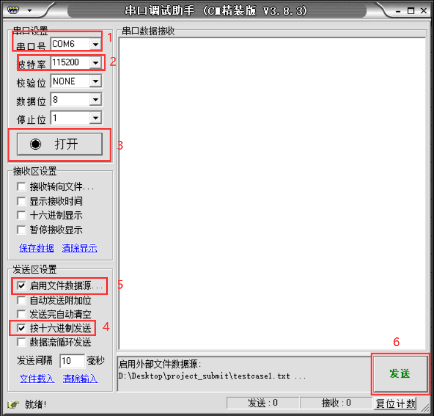
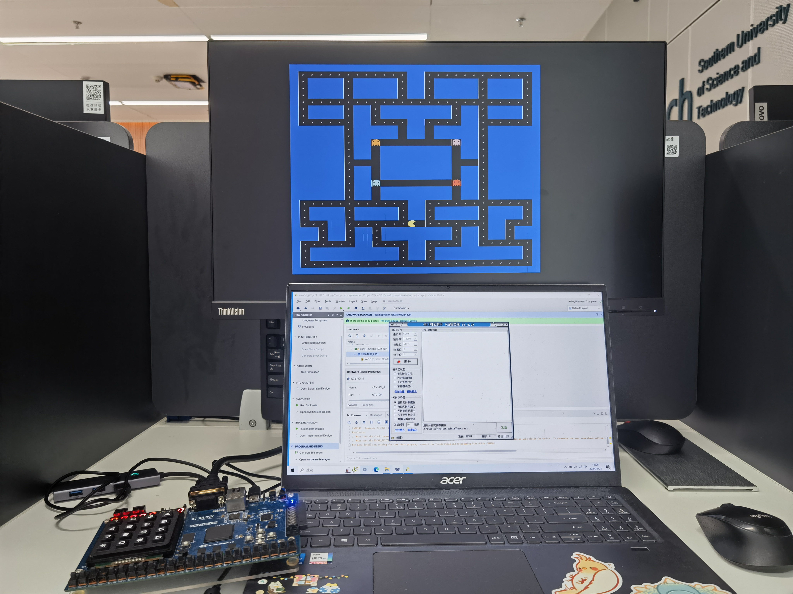

# CS202 课程项目 CPU 报告

本报告为 2024 年春季南方科技大学计算机系课程 CS202 计算机组成原理的课程项目报告


## 团队分工

> Lab: 周一56节 王晴老师

| 学号     | 姓名    | 分工                 | 贡献比 |
| -------- | ------ | ------------------- | ------ |
| 12211655 | 于斯瑶  | IO 实现、汇编软件 | 33.33% |
| 12110120 | 赵钊   | 架构设计、上板调试 | 33.33% |
| 12212231 | 陈贲   | 核心开发、仿真测试       | 33.33% |


## 计划日程安排和实施情况

| 时间          | 任务                                          |
| ------------- | -------------------------------------------- |
| 2024-3-18 | MineCPU 项目启动 |
| 2024-3-18 | 设计初始基本架构 (Stage 和 Stage 间 Regs) |
| 2024-3-18 | 完成寄存器模块、立即数生成模块 |
| 2024-3-29 | 完成 ALU 模块 |
| 2024-3-30 | 完成数据冒险前递模块 |
| 2024-3-30 | 完成 7 段数码管模块 |
| 2024-4-6 | 完成分支预测模块初版 |
| 2024-4-7 | 完成 Memory 模块初版 |
| 2024-4-9 | 完成分支预测模块 |
| 2024-4-9 | 顶层模块接线 |
| 2024-4-15 | 优化 MineCPU 架构 |
| 2024-4-18 | 实现异常中断 (`ecall` 指令实现) |
| 2024-4-19 | 完成 UART 模块 |
| 2024-4-21 | 优化分支预测: 添加返回地址栈 (RAS) |
| 2024-4-23 | 增加对 RV32M 指令的支持 |
| 2024-4-29     |  Project 发布                                |
| 2024-5-1 | 完成指令缓存 (ICache) |
| 2024-5-3 | 完成 Pacman 初版 |
| 2024-5-4 | 完成数据缓存 (DCache) |
| 2024-5-7 | 完成 UART 上板测试 |
| 2024-5-9 | 完成 MineCPU 上板测试 |
| 2024-5-11 | 完成场景测试 1 汇编 |
| 2024-5-11 | 完成 VGA 模块 |
| 2024-5-13 | 完成 VGA 上板测试 |
| 2024-5-14 | 完成场景测试 2 汇编 |
| 2024-5-17 | 完成 Pacman 上板测试 |
| 2024-5-20 | 完成报告 |

**以上计划均顺利按时完成** 

#### 版本修改记录 (Git Commit Log)

[Github Link](https://github.com/wLUOw/CS202_MineCPU) (仓库将会在 Project DDL 后公开)


## CPU架构设计说明

### CPU 特性

- **冯诺依曼架构**支持 **RISC-V** 指令集的**五级流水线** CPU，CPI 约为 5.1[^1] (存在分支预测未命中和 Cache 未命中产生的停顿)
  + 采用前递、分支预测的方式解决冒险
  + 含 32 个 32 bit 的寄存器 (不含 pc 寄存器)
  + 寻址单位为 32 bit (4 byte)
  + 冯诺依曼架构不对指令空间和数据空间进行区分
  + 栈空间基址为 0x7ffc
- **时钟频率:** 
  + CPU: 最高可支持 50MHz
  + MEM: 与 CPU 同频
  + VGA: 40MHz
- **分支预测**:
  + BHT: 32 entries, 2 bits
  + RAS: 32 entries, 32 bits
- **Cache**:
  + ICache: 直接映射, 1472 bits, 32 entries
  + DCache: 直接映射/写回, 1504 bits, 32 entries
- **异常控制**:
  + ecall: 外部设备驱动, 通过 MMIO 进行输入输出, API doc 见后续 Environment Call
  + 中断返回时使用 `sret` 指令

[^1]: 基于BHT的分支预测器准确率约为90%, 假设分支指令有20%, CPI为 5 * 0.8 + 5 * 0.2 * 0.9 + 7 * 0.2 * 0.1 = 5.04。Cache 命中率约为90%, 假设sd和ld指令占10%， 则CPI = 5.04 * 0.8 + (7.04 * 0.1 + 9.04 * 0.1) * 0.1 + 5.04 * 0.2 * 0.9 = 5.1

### ISA

参考 RISC-V 基本指令集 (RV32I) 及乘除法拓展 (RV32M)

| 指令                    | 指令类型 | 执行操作                                  |
| ----------------------- | -------- | ----------------------------------------- |
| `add rd, rs1, rs2`      | R        | rd = rs1 + rs2                            |
| `sub rd, rs1, rs2`      | R        | rd = rs1 - rs2                            |
| `xor rd, rs1, rs2`      | R        | rd = rs1 ^ rs2                            |
| `or rd, rs1, rs2`       | R        | rd = rs1 \| rs2                           |
| `and rd, rs1, rs2`      | R        | rd = rs1 & rs2                            |
| `sll rd, rs1, rs2`      | R        | rd = rs1 << rs2                           |
| `srl rd, rs1, rs2`      | R        | rd = rs1 >> rs2                           |
| `sra rd, rs1, rs2`      | R        | rd = rs1 >> rs2 (sign-extend)             |
| `slt rd, rs1, rs2`      | R        | rd = ( rs1 < rs2 ) ? 1 : 0                |
| `sltu rd, rs1, rs2`     | R        | rd = ( (u)rs1 < (u)rs2 ) ? 1 : 0          |
| `addi rd, rs1, rs2`     | I        | rd = rs1 + imm                            |
| `xori rd, rs1, rs2`     | I        | rd = rs1 ^ imm                            |
| `ori rd, rs1, rs2`      | I        | rd = rs1 \| imm                           |
| `andi rd, rs1, rs2`     | I        | rd = rs1 & imm                            |
| `slli rd, rs1, rs2`     | I        | rd = rs1 << imm[4:0]                      |
| `srli rd, rs1, rs2`     | I        | rd = rs1 >> imm[4:0]                      |
| `srai rd, rs1, rs2`     | I        | rd = rs1 >> imm[4:0] (sign-extend)        |
| `slti rd, rs1, rs2`     | I        | rd = (rs1 < imm) ? 1 : 0                  |
| `sltiu rd, rs1, rs2`    | I        | rd = ( (u)rs1 < (u)imm ) ? 1 : 0          |
| `lb rd, imm(rs1)`       | I        | 读取 1 byte 并做符号位扩展                |
| `lh rd, imm(rs1)`       | I        | 读取 1 half-word (2 bytes) 并做符号位扩展 |
| `lw rd, imm(rs1)`       | I        | 读取 1 word (4 bytes)                     |
| `lbu rd, imm(rs1)`      | I        | 读取 1 byte 并做 0 扩展                   |
| `lhu rd, imm(rs1)`      | I        | 读取 2 byte 并做 0 扩展                   |
| `sb rd, imm(rs1)`       | S        | 存入 1 byte                               |
| `sh rd, imm(rs1)`       | S        | 存入 1 half-word (2 bytes)                |
| `sw rd, imm(rs1)`       | S        | 存入 1 word (4 bytes)                     |
| `beq rs1, rs2, label`   | B        | if (rs1 == rs2)  PC += (imm << 1)         |
| `bne rs1, rs2, label`   | B        | if (rs1 != rs2)  PC += (imm << 1)         |
| `blt rs1, rs2, label`   | B        | if (rs1 < rs2)  PC += (imm << 1)          |
| `bge rs1, rs2, label`   | B        | if (rs1 >= rs2)  PC += (imm << 1)         |
| `bltu rs1, rs2, label`  | B        | if ( (u)rs1 < (u)rs2 )  PC += (imm << 1)  |
| `bgeu rs1, rs2, label`  | B        | if ( (u)rs1 >= (u)rs2 )  PC += (imm << 1) |
| `jal rd, label`         | J        | rd = PC + 4; PC += (imm << 1)             |
| `jalr rd, rs1, imm`     | I        | rd = PC + 4; PC = rs1 + imm               |
| `lui rd, imm`           | U        | rd = imm << 12                            |
| `auipc rd, imm`         | U        | rd = PC + (imm << 12)                     |
| `ecall`                 | I        | 控制权交给固件 (采用输入设备模拟)         |
| `sret` *                | I        | 控制权交还给程序                          |
| `mul rd, rs1, rs2` *    | R        | rd = (rs1 * rs2)[31:0]                    |
| `mulh rd, rs1, rs2` *   | R        | rd = (rs1 * rs2)[63:32]                   |
| `mulhsu rd, rs1, rs2` * | R        | rd = (rs1 * (u)rs2)[63:32]                |
| `mulhu rd, rs1, rs2` *  | R        | rd = ( (u)rs1 * (u)rs2 )[63:32]           |
| `div rd, rs1, rs2` *    | R        | rd = rs1 / rs2                            |
| `rem rd, rs1, rs2` *    | R        | rd = rs1 % rs2                            |


### Environment Call

| 调用 No. (a7) | 参数 | 功能                          | 返回值 |
| :------------ | ---- | ----------------------------- | ------ |
| 0x01          | a0   | 写入 1 Byte 到第一组 LED 显示 | N/A    |
| 0x02          | a0   | 写入 1 Byte 到第二组 LED 显示 | N/A    |
| 0x03          | a0   | 写入 4 Bytes 到七段数码管显示 | N/A    |
| 0x05          | N/A  | 从第一组拨码开关读入 1 Byte   | a0     |
| 0x06          | N/A  | 从第二组拨码开关读入 1 Byte   | a0     |
| 0x07          | N/A  | 从第三组拨码开关读入 1 Byte   | a0     |
| 0x0A          | N/A  | 结束程序 (死循环)             | N/A    |


### IO

- 使用 **MMIO** (Memory Mapping IO，内存映射) 进行 IO 操作并支持 UART
- 输入 (Input)
  - 24 个拨码开关
  - 5 个按钮
  - 4 × 4 小键盘
- 输出 (Output)
  - 支持 24 个 LED 灯, 其中 8 个用于显示 CPU 状态
  - 7 段数码管, 可显示 4 Bytes
  - VGA

**MMIO 对应地址** 

| 地址                 | 读/写 | 映射内容               | 取值范围 (省略前导0)    |
| :------------------- | ----- | ---------------------- | ----------------------- |
| 0xFFFFFF00           | R     | 第 1 组拨码开关 (8 个) | 0x00 - 0xFF             |
| 0xFFFFFF04           | R     | 第 2 组拨码开关 (8 个) | 0x00 - 0xFF             |
| 0xFFFFFF08           | R     | 第 3 组拨码开关 (8 个) | 0x00 - 0xFF             |
| 0xFFFFFF0C           | W     | 第 1 组 LED (8 个)     | 0x00 - 0xFF             |
| 0xFFFFFF10           | W     | 第 2 组 LED (8 个)     | 0x00 - 0xFF             |
| 0xFFFFFF14           | R     | 按钮 1 (中)            | 0x00 - 0x01             |
| 0xFFFFFF18           | R     | 按钮 2 (上)            | 0x00 - 0x01             |
| 0xFFFFFF1C           | R     | 按钮 3 (下)            | 0x00 - 0x01             |
| 0xFFFFFF20           | R     | 按钮 4 (左)            | 0x00 - 0x01             |
| 0xFFFFFF24           | R     | 按钮 5 (右)            | 0x00 - 0x01             |
| 0xFFFFFF28           | W     | 七段数码管             | 0x00000000 - 0xFFFFFFFF |
| 0xFFFFFF2C           | R     | 4*4 小键盘是否被按下   | 0x00 - 0x01             |
| 0xFFFFFF30           | R     | 4*4 小键盘按下位置     | 0x00 - 0x0F             |
| 0xFFFFE___ (000-BFF) | W     | VGA 字符               | 0x00 - 0xFF             |
| 0xFFFFD___ (000-BFF) | W     | VGA 颜色               | 0x00 - 0xFF             |


### CPU 接口

```systemverilog
module Top (
    // clk -> cpuclk, memclk, vgaclk
    input                     clk, rst,
    // uart related
    input  logic              rx,
    // interact with devices
    input  logic [`SWCH_WID ] switches1, switches2, switches3,
    input  logic              bt1, bt2, bt3, bt4, bt5,
    input  logic [`KBPIN_WID] kp,
    output logic [`LED_WID  ] led1_out, led2_out, led3_out,
    output logic [`LED_WID  ] seg_en, seg_out,
    // vga interface
    output logic              hsync,              // line synchronization signal
    output logic              vsync,              // vertical synchronization signal
    output logic [`COLOR_WID] red,
    output logic [`COLOR_WID] green,
    output logic [`COLOR_WID] blue
);
```

MineCPU 的输入信号包含：

- 一个 100MHz 的晶振时钟
- 高电平复位信号 rst
- UART 通信串口 rx
- 3 组拨码开关
- 5 个按钮
- 4 × 4 小键盘信号

输出信号包含：

- 3 组 led 
- 7 段数码管的控制信号
- VGA 的控制信号


### CPU 内部结构

<div align="center">
    
    
</div>

<div align="center">
    
    
</div>

<div align="center">
    
    
</div>

<div align="center">
    
    
</div>

以上是 Vivado 生成的 Schematic 图，但并不能清晰的展现总体结构，下图清晰的展现了 MineCPU 的设计架构与模块间的关联

<div align="center">
    
</div>

下面将对主要模块端口及功能进行说明 **(不包含 5 个 Stage 模块和 Stage 间的 Regs，它们只起到封装和传输信号作用)** 

#### ALU

```systemverilog
module ALU (
    input  logic [`DATA_WID ] src1, src2,
    input  logic [`ALUOP_WID] ALU_op,
    output logic [`DATA_WID ] result
);
```

ALU 模块，起计算作用，输入 32 bit 数据 src1 和 src2 及控制信号 ALU_op，输出 32 bit 的结果 result.

#### Branch_Predictor *

见 [Bonus 部分](#branch_predictor)

#### BRU (Branch Unit)

```systemverilog
module BRU (
	input  logic [`DATA_WID ] src1, src2, pc, imm,
	input  logic [`BRUOP_WID] BRU_op,
	input  logic              Jalr,
	output logic [`DATA_WID ] old_pc,
	output logic              old_branch, result
);
```

用于处理分支指令的结果，可理解为分支指令的专属 ALU，同时处理下一条指令的真实 pc，并判断分支预测是否正确即是否需要停顿.

#### Const

用于储存所有常数的头文件 (.svh)

#### Control

```systemverilog
module Control (
    input  logic [`DATA_WID] inst, 
    output logic [`CTRL_WID] total_ctrl
);
```

控制单元，输入 32 bit 的指令，输出位宽为 17 bit 的控制总线，包含 EX 阶段、MEM 阶段和 WB 阶段的控制信号

#### CPU

```systemverilog
module CPU (
    input  logic               cpuclk, memclk, rst_n,
    // uart related
    input  logic [`DATA_WID  ] uart_data,
    input  logic [`DATA_WID  ] uart_addr,
    input  logic               uart_done,
    // interact with devices
    input  logic [`LED_WID   ] switches1, switches2, switches3,
    input  logic               bt1, bt2, bt3, bt4, bt5,
    input  logic [`KBCODE_WID] kb_idx,
    output logic [`LED_WID   ] led1_out, led2_out, led3_out,
    output logic [`DATA_WID  ] seg1_out,
    // vga interface
    input  logic [`VGA_ADDR  ] vga_addr,
    output logic [`INFO_WID  ] char_out,
    output logic [`INFO_WID  ] color_out,
    // debug port
    output logic [`DATA_WID  ] pc_t,
    output logic [`DATA_WID  ] inst_t
);
```

CPU 的顶层模块，仅包含 CPU，不包含 IO 处理如 7 段数码管和 VGA，也不包含 UART.

#### DCache *

见 [Bonus 部分](#Dcache)

#### Forward *

见 [Bonus 部分](#Forward)

#### Hazard *

见 [Bonus 部分](#Hazard)

#### ICache *

见 [Bonus 部分](#ICache)

#### ImmGen

```systemverilog
module ImmGen (
    input  logic [`DATA_WID] inst,
    output logic [`DATA_WID] imm
);
```

立即数生成模块，输入 32 bit 指令，根据指令类型生成符号扩展的 32 bit 立即数

#### Memory

```systemverilog
module Memory (
    input                      rst,
    input                      clka, clkb,
    input  logic [`DATA_WID  ] addra, addrb,
    input  logic [`DATA_WID  ] write_datab,
    input  logic               web, // port b write enable
    output logic [`DATA_WID  ] dataa, datab,
    // IO related
    input  logic [`SWCH_WID  ] switches1, switches2, switches3,
    input                      bt1, bt2, bt3, bt4, bt5,   // middle, up, down, left, right
    input  logic [`KBCODE_WID] kb_idx,                    // keyboard index: 0 1 2 3 4 5 6 7 8 9 A B C D * #
    output logic [`DATA_WID  ] seg1_out,
    output logic [`LED_WID   ] led1_out, led2_out,
    // vga related
    input  logic [`VGA_ADDR  ] vga_addr,
    output logic [`INFO_WID  ] char_out,
    output logic [`INFO_WID  ] color_out
);
```

内存模块，输入输出包含内存相关信号，IO 相关信号. IO 采用轮询的 MMIO 模式.

#### PC

```systemverilog
module PC (
    input                    clk, rst,
    input  logic             PC_Write,   // hazard stall 1: yes, 0: no
    input  logic             icache_stall,
    input  logic             dcache_stall,
    input  logic [`DATA_WID] new_pc,     // next pc
    output logic [`DATA_WID] pc_out
);
```

管理指令 pc 的模块，输入包含因与内存交互导致数据冒险的停顿信号，指令缓存和数据缓存未命中的停顿信号，输出包含新 pc.

#### RegisterFile

```systemverilog
module RegisterFile (
    input  logic             clk, rst,
    input  logic [`REGS_WID] read_reg_1, read_reg_2, write_reg,
    input  logic [`DATA_WID] write_data,
    input  logic             RegWrite,
    output logic [`DATA_WID] read_data_1, read_data_2
);
```

寄存器模块，输入包含时钟和复位信号，寄存器写入信号，和5 bit 位宽的读取寄存器的 rd1，rd2，写入寄存器的 write_reg. 输出包含 32 bit 的从寄存器读取到的数据.

#### CPU_Clk

```systemverilog
module CPU_Clk (
    input clk,
    output clk0
);
```

注意到 ip Clocking Wizard 能够生成的时钟范围仅为 6MHz 到 80MHz，因此如果需要生成更低频比如 1MHz 的时钟，需要分频器，而 CPU_Clk 模块的作用就是分频.

#### Keyboard

```systemverilog
module Keyboard (
    input  logic [`KBPIN_WID ] kp,
    output logic [`KBCODE_WID] kb_idx
);
```

小键盘的控制模块.

#### Queue *

见 [Bonus 部分](#queue)

#### Seg7Tube

```systemverilog
module Seg7Tube(
    input               clk, rst_n,                // clock, reset
    input        [31:0] data_in,                   // 7-segment display data
    output logic [7:0]  seg_en,                    // scan signal
    output logic [7:0]  seg_out                    // 7-segment display
);
```

七段数码管的控制模块，数据要显示的数据，输出七段数码管的扫描信号和使能信号.

#### UART *

见 [Bonus 部分](#uart)

#### VGA *

见 [Bonus 部分](#vga)


## 使用说明

下图为 Minisys 的使用说明图例

<div align="center">
    
</div>

#### 详细使用步骤如下：

 1. **创建 Vivado 项目**：通过 Vivado 创建一个 RTL Project，Project device 选择 **xc7a100tfgg484-1**，Target Language设置为 VHDL，设置完毕并创建项目后，将所有 System Verilog 文件作为设计文件导入，再将 constr.xdc 作为约束文件导入

 2. **创建 IP 核** 

    - 创建 Clocking Wizard

      - 将组件名称改为 VGAClkGen
      - 选择 PLL 时钟
      - 将 clk_in1 的 Source 修改为 Global buffer
      - 将 clk_out1 的频率设置为 40MHz 并取消 reset 信号和 locked 信号

      <div align="center">
          
          
      </div>

      <div align="center">
          
          
      </div>

    - 创建 Block Memory Generator

      - 将组件名称改为 Mem
      - Memory Type 选择 True Dual Port RAM
      - Port A 的 Write Width 修改为 32，Write Depth 修改为 16384 (Read Width, Read Depth 和 Port B 的相关参数会自动修改)

      <div align="center">
          
          
      </div>

 3. **在 Vivado 中依次 Synthesis -> Implementation -> Generate Bitstream (注: 可以在等待过程中先进行下面的第 4 和 5 步)，将生成比特流文件 (.bit) 烧写进 FPGA** 

 4. **获取执行代码的机器码文件**：使用 RARS 打开需要执行的汇编代码，点击运行，再点击左上角 File，选择 Dump Memory，Dump Format 选择 Hexadecimal Text，点击 Dump To File... 并输入文件名后保存 (**注: 不需要带后缀**)

    <div align="center">
        
        
    </div>

 5. **获取 UART 串口传输的文件**：将上一步得到的文件放在指令转换脚本 inst2txt.py 同一目录下，打开 inst2txt.py 将第 4 行的 `filename` 改为上一步所得的文件的名称，运行脚本，得到一个 .txt 文件 (如 test.txt)，这是要通过 UART 串口传输给 CPU 运行的指令

 6. **通过 UART 加载程序并运行**：打开串口工具 UARTAssist.exe，串口号选择 COM6 (一般来说直接选能选的最后一个)，波特率设置为 115200，打开连接，发送选项选择 “按十六进制发送” 并 “启用文件数据源...”，选择上一步得到的 .txt 文件并确定，然后点击发送，发送完毕后 CPU 将会自动开始运行

    <div align="center">
        
    </div>


## 测试说明

批量测试汇编代码比较繁琐，因为需要在rars中打开（rars用的是Java文件浏览器及其难用），然后汇编并导出text和data段，最后再生成coe文件导入到IP核设置中。并且确认CPU运行结果需要检查32个寄存器的值，非常容易出错。于是我们决定寻找其他测试方案，最后确定使用Verilator仿真+Unicorn虚拟机做差分测试。这个方案使用[riscv-gnu-toolchain](https://github.com/riscv-collab/riscv-gnu-toolchain) 并编写Makefile自动化编译成二进制，然后可以快速加载编译好的程序，每一个周期都可以对比CPU和参考结果，如果不一致，暂停并输出波形图。这个方案非常高效，使得我们的开发流程非常方便迅速。仿真激励文件见[sim](../sources/sim)文件夹下的`*.cpp`文件。以下表格按测试时间顺序排列。

|    测试方法   | 测试类型 | 测试用例描述 | 测试结果 |
| :----------: | :------: | :----------: | :------: |
| Verilator 仿真 | 单元测试/ALU | 使用Verilartor仿真器并编写[C++仿真激励文件](../sources/sim/ALU_Sim.cpp)，使用STL随机数生成器生成ALU的两个操作数，再随机生成ALUOp测试指令类型。同时将操作数和ALUOp输入到ALU单元和C++代码，生成两个结果并对比，C++的输出作为参考值。若不相同，输出输入数据和答案对比。 | 通过 |
| Verilator 仿真 | 单元测试/Forward | 使用Verilartor仿真器并编写[C++仿真激励文件](../sources/sim/Forward_Sim.cpp)，对样例进行编码。由于指令难以随机生成，且随机生成的样例也大概率不存在Hazard，因此采用课本的样例和其他CPU测试文件的样例。将答案编码进仿真文件并对比，不相同则输出该样例数据。 | 通过 |
| Verilator 仿真 | 单元测试/ImmGen | 使用Verilartor仿真器并编写[C++仿真激励文件](../sources/sim/ImmGen_Sim.cpp)，使用STL随机数生成器随机选取Opcode并生成高25位。用C++编写ImmGen模块（参考现有的CPU仿真文件），其输出作为参考值。将数据同时输入到C++和模块中，得到并对比输出。若不相同，输出输入数据和答案。 | 通过 |
| Verilator 仿真 | 单元测试/Memory | 使用Verilartor仿真器并编写[C++仿真激励文件](../sources/sim/Memory_Sim.cpp)。该测试对象是Cache之前的Memory，包括IP RAM和sb/sh/sw/lb/lbu/lh/lhu/lw的逻辑正确性。该逻辑已移动到DCache中。由于Verilator不支持Vivado的IP核仿真，于是编写一个模拟IP RAM的模块MemoryAnalog，该模块在Vivado上仿真波形与IP核一致。 | 通过 |
| Verilator 仿真 | 单元测试/UART | 使用Verilartor仿真器并编写[C++仿真激励文件](../sources/sim/UART_Sim.cpp)。完成CPU接线后加入UART模块测试正确性。编写C++仿真激励文件，导入CPU测试文件的二进制并模拟UART发送过程，使用Verilator支持的VPI功能访问CPU内存确认数据正确写入。 | 通过 |
| Verilator 仿真 | 集成测试/CPU | 使用Verilartor仿真器并编写[C++仿真激励文件](../sources/sim/CPU_Sim.cpp)测试汇编代码文件见[assembly](../sources/assembly/test_sim/)。导入二进制文件并模拟UART行为写入内存。然后同时运行CPU和Unicorn模拟器，使用VPI读取寄存器并对比二者寄存器的值，相同则通过测试。同时检查PC，避免PC进入死循环。 | 通过 |
| 上板测试 | 单元测试/UART | 测试UART写入IP RAM的功能，并把数据输出到数码管上显示。 | 通过 |
| 上板测试 | 集成测试/Testcase 1 | 测试CPU功能与Testcase测试场景1汇编代码的正确性。 | 通过 |
| 上板测试 | 集成测试/Testcase 2 | 测试Testcase测试场景2汇编代码的正确性。 | 通过 |
| 上板测试 | 集成测试/Bonus Testcase | 测试Pacman吃豆人游戏的正确性和VGA的功能。 | 通过 |

### 测试结论

测试全部通过。整个测试流程的顺利进行印证了这套方案的合理性。先仿真确保行为逻辑正确，再进行上板调试时序问题，尽量减少上板测试的次数。测试在开发中占大部分比例，因此减少测试开销是十分必要的。


## 非 Bonus 部分的问题及解决方案

+ **[Memory/Solved]** 内存读取数据时传入地址会延迟一个周期读取到数据，且 `sh` 和 `sb` 无法直接对内存进行操作.
  - **原因**: 使用 ip RAM 生成的内存以 32 bit 为单位进行存或读取，而 `sh` 和 `sb` 只修改其中的 16 bit 或 8 bit
  - **解决方案**:
    1. :negative_squared_cross_mark: 加快内存时钟频率，先读取再修改最后存入
    2. :white_check_mark: 使用 Cache 进行管理


## Bonus 相关说明

### MineCPU 性能优化

MineCPU Project 主要采用了两个方向上的性能优化，第一个是采用**五级流水线**的结构，第二个是加入了指令缓存 (ICache) 和数据缓存 (DCache)，涉及的模块如下

- Forward、Hazard 为解决数据冒险的控制流水线前递和停顿的模块
- Branch_Predictor 为解决控制冒险的分支预测模块
- ICache、DCache 分别为指令和数据缓存，为提升与内存交互的效率的缓存模块

#### Forward

```systemverilog
module Forward (
    input  logic [`REGS_WID] ID_EX_rs1, ID_EX_rs2, EX_MEM_rd, MEM_WB_rd,
    input  logic             EX_MEM_RegWrite, MEM_WB_RegWrite,
    output logic [`FW_WID  ] fwA, fwB // 00: no fwd, 01: from MEM/WB, 10: from EX/MEM
);
```

前递模块，输入相关信号，输出是否前递的控制信号. 以 ALU 的 src1 输入数据为例，src1 数据的前递选择器逻辑为，若 `EX_MEM_RegWrite & (EX_MEM_rd != 0) & (EX_MEM_rd == ID_EX_rs1)` 成立，那么将从 MEM 阶段前递数据，若 `MEM_WB_RegWrite & (MEM_WB_rd != 0) & ~(EX_MEM_RegWrite & (EX_MEM_rd != 0) & (EX_MEM_rd == ID_EX_rs1)) & (MEM_WB_rd == ID_EX_rs1)` 成立，将从 WB 阶段前递数据，其余情况均不需要前递.

#### Hazard

```systemverilog
module Hazard (
    input  logic [`REGS_WID] IF_ID_rs1, IF_ID_rs2, ID_EX_rd,
    input  logic             ID_EX_MemRead,
    output logic             stall, IF_ID_Write, PC_Write  // 1 stall, 0 not stall
);
```

Hazard 模块用于判断是否存在因与内存交互而需停顿一个时钟周期的数据冒险，例如下面代码

```assembly
lw t3, 0(t1)
xori t3, t3, -1
```

该种数据冒险停顿的判断逻辑为如果 `ID_EX_MemRead & ((ID_EX_rd == IF_ID_rs1) | (ID_EX_rd == IF_ID_rs2))` 成立，则需要停顿，其余情况无需停顿.

#### Branch_Predictor

```systemverilog
module Branch_Predictor # (
    parameter BHT_SIZE = 4,
    parameter RAS_SIZE = 4
) (
    input  logic             clk, rst,
    input  logic             stall,
    // whether to branch and predict, excp is ecall
    input  logic             branch, predict, excp, sret,
    // calculate branch target
    input  logic [`REGS_WID] rs1, rd,
    input  logic [`DATA_WID] pc, imm,
    // update table, and predict fail
    input  logic [`DATA_WID] old_pc, old_branch_pc, old_predict_pc,
    input  logic             old_predict, old_actual, old_branch,
    // target pc is predicted pc, pass predict_result to EX, predict_fail to flush
    output logic [`DATA_WID] target_pc,
    output logic             predict_result, predict_fail
);
```

分支预测模块在 IF 阶段进行，由于在 IF 阶段并未将指令解码，而预测某指令是否为分支指令过于复杂，因此采取预解码的方式判断该指令是否为分支指令。分支预测的实现方式为状态机，有强不跳转、弱不跳转、弱跳转、强跳转这 4 种状态，`history_table` 中假设所有分支初始都是弱不跳转，预测时按照状态处于跳转或不跳转进行预测，若预测失败，流水线清空错误指令并执行正确指令，并在每次预测后更新 `history_table`.

此外，分支预测中还加入了返回地址栈 [Return Address Stack (RAS)]，用于解决方法调用结束后返回时 ra 寄存器可能存在的数据冒险. RAS 在遇到 `call` 或 `ret` 指令时将压入 / 弹出 ra 寄存器的内容，记录指令跳转目标地址，在 EX 阶段计算实际跳转，并判断是否预测错误，如错误则更新正确 pc 并清空错误指令.

#### ICache

```systemverilog
module ICache #(
    parameter CACHE_WID = 4
)(
    input  logic             clk, rst,
    // cpu interface
    input  logic [`DATA_WID] addr,
    input  logic             predict_fail,
    output logic [`DATA_WID] inst,
    output logic             icache_stall,
    // mem interface
    input  logic [`DATA_WID] mem_inst,
    output logic [`DATA_WID] mem_pc
);
```

指令缓存模块用于管理指令的读取，缓存格式如下. 运行模式为如果 `tag` 不一样说明未命中，那么将流水线停顿并从内存中读取数据，输出并存入缓存. **值得注意的是，缓存的停顿需要做到和数据冒险停顿互不影响，否则流水线的执行将会出现错误.** 

```systemverilog
// format: valid[38] | tag[37:32] | data[31:0]
reg  [46-CACHE_WID:0] cache [0: (1 << CACHE_WID) - 1];
```

指令缓存相比数据缓存会略微简单，因为只需从内存读取. **由于可以采用内存的时钟频率大于 CPU 时钟频率这一设计，因此还涉及到一个非常核心的问题，缓存的必要性. 加快内存时钟使得所需数据可以即时获取看似聪明，实际上是十分不切实际的，在真实的计算机中，内存由于容易巨大，可承受的时钟频率将会远小于 CPU，因此采取加快内存时钟频率的设计并不科学，缓存依旧有存在的必要性.**

#### DCache

```systemverilog
module DCache #(
    parameter CACHE_WID = 4
)(
    input  logic             clk, rst,
    // cpu interface
    input  logic [`DATA_WID] addr,
    input  logic [`DATA_WID] write_data,
    input  logic [`LDST_WID] MEMOp,
    input  logic             MemRead,
    input  logic             MemWrite,
    output logic [`DATA_WID] data_out,
    output logic             dcache_stall,
    // mem interface
    input  logic [`DATA_WID] mem_data,
    output logic [`DATA_WID] mem_addr,
    output logic [`DATA_WID] mem_write_data,
    output logic             mem_web
);
```

数据缓存需注意一下 3 点：

- 数据缓存原理与指令缓存相似，但与内存的交互不仅限于读取，还包括写入
- 若地址为 MMIO 相关，将无需经过缓存判断命中与停顿，直接与内存进行读取和写入
- 同时，由于寻址单位为 32 bit，`lb`, `lh`, `sb`, `sh` 等指令需对数据进行切片，数据缓存中也需要相应的处理这些情况


### MineCPU 功能扩展

MineCPU 实现了以中断的方式处理异常，指令 `ecall` 的实现就是通过异常中断，将控制权交给固件. 在中断时，会将中断前的 pc 赋值给 ID 阶段的寄存器 epc (详细可见报告中 CPU 内部结构的架构图)，并跳转至异常处理的统一地址 0x1c090000，将控制权交给固件 (这里是 IO 设备). 而固件通过 `sret` 指令将控制权交还给 CPU，CPU 加载 epc 中的值并赋值给 pc 从而继续程序的运行.

除了采用异常中断的方式实现 `ecall` 外，MineCPU 还实现了 `lui` 和 `auipc`，只需在 EX 阶段稍微修改数据通路并添加选择器即可 (见报告中 Bonus 部分的问题及解决方案). 同时也需在控制单元中增加相应的控制情况，代码如下

```systemverilog
 always_comb begin : Ctrl_Signal_Gen
    unique case (inst[`OP_WID])
        // other cases leave out
        `LUI_OP: begin
            ALUOp    = `ALU_ADD;
            BRUOp    = `BRU_NOP;
            Jalr     = 0;
            ALUSrc   = 1;
            MemWrite = 0;
            MemRead  = 0;
            RegWrite = 1;
            MemtoReg = 0;
            MEMOp    = 0;
        end
        `AUIPC_OP: begin
            ALUOp    = `ALU_ADD;
            BRUOp    = `BRU_NOP;
            Jalr     = 0;
            ALUSrc   = 3;
            MemWrite = 0;
            MemRead  = 0;
            RegWrite = 1;
            MemtoReg = 0;
            MEMOp    = 0;
        end
        `ECALL_OP: begin
            ALUOp    = `ALU_ADD;
            BRUOp    = `BRU_NOP;
            Jalr     = 0;
            ALUSrc   = 0;
            MemWrite = 0;
            MemRead  = 0;
            RegWrite = 0;
            MemtoReg = 0;
            MEMOp    = 0;
        end
    endcase
end
```


### UART 的实现

出于兼容性的考虑，本项目并未使用课程提供的IP核而是选择自己编写。本项目的 UART 波特率为 115200，参数为 8 bit 数据配合 1 bit 停止位。 由于寻址单位为 32 bit，因此需要一个队列来实现接受并计数 4 byte 数据后统一存进内存。

#### Queue

```systemverilog
module Queue (
    input  logic        clk, rst,
    input  logic [7:0]  data_in,
    input  logic        ready_in,
    output logic [31:0] data_out,
    output logic [31:0] addr_out
);
```

队列能够将 4 个 8 bit 的数据拼接并计算需要存入内存的内存地址，核心代码如下

```systemverilog
always_ff @(posedge clk) begin : write
    if (rst || (full && clk_cnt == 15)) begin
        cnt <= 0;
        data_queue <= 0;
    end else if (ready_in) begin
        cnt <= cnt + 1;
        data_queue <= {data_in, data_queue[31:8]};
    end else begin
        cnt <= cnt;
        data_queue <= data_queue;
    end
end
```

#### UART

```systemverilog
module UART (
    input                    clk, rst, rx,
    // ports to memory
    output logic [`DATA_WID] data_out,
    output logic [`DATA_WID] addr_out,
    output logic             done
);
```

UART 负责接收端口 `rx` 传入的信息，借助队列解析成需要的数据并存入内存，同时有一个代表是否传输完毕的信号。UART 接受数据的代码逻辑如下

```systemverilog
// receive data
always_ff @(posedge clk) begin
    if (rst) begin
        rx_data <= 8'd0;
        received <= 1'b0;
    end else if (en_state) begin
        received <= 1'b1;
        case (bit_cnt)
            4'd1: rx_data[0] <= rxd_t2;
            4'd2: rx_data[1] <= rxd_t2;
            4'd3: rx_data[2] <= rxd_t2;
            4'd4: rx_data[3] <= rxd_t2;
            4'd5: rx_data[4] <= rxd_t2;
            4'd6: rx_data[5] <= rxd_t2;
            4'd7: rx_data[6] <= rxd_t2;
            4'd8: rx_data[7] <= rxd_t2;
         default: rx_data <= rx_data;
        endcase
    end else begin
        rx_data <= rx_data;
        received <= received;
    end
end
```

控制 `done` 信号的逻辑如下

```systemverilog
// receive done logic
always_ff @(posedge clk) begin
    if (rst) begin
        rx_done <= 1'b0;
    end else if (en_state) begin
        if(bit_cnt == 0) rx_done <= 1'b0;
        else if(bit_cnt == 9 && baud_cnt == `BPS_CNT - 1) rx_done <= 1'b1;
        else if(rx_done == 1'b1) rx_done <= 1'b0;
        else rx_done <= rx_done;
    end else if(rx_done == 1'b1) rx_done <= 1'b0;
    else rx_done <= rx_done;
end
```


### VGA 的实现

<div align="center">
    
</div>

VGA 采用字符映射的方式实现，即全屏共可以显示 96 × 32 个字符，每个字符的颜色和对应的编号 (基本为 ASCII 码)。 在内存中，与其他 IO 一样，VGA 也采用 MMIO，字符编号对应的地址为 0xFFFFEXXX，颜色对应的地址为 0xFFFFDXXX，在 Memory 中被称为缓冲区。 可以通过汇编往缓冲区中写入，从而将字符显示在屏幕上.

#### VGA

```systemverilog
module VGA (  // 800×600 60Hz
    input  logic              clk,      // clk: 40MHz
    // get char and color from memory
    output logic [`VGA_ADDR]  vga_addr,
    input  logic [`INFO_WID ] ch,
    input  logic [`INFO_WID ] color,    // 0: black   1: yellow      2: red        3: pink
                                        // 4: orange  5: light blue  6: dark blue  7: white
    // output to VGA
    output logic              hsync,    // line synchronization signal
    output logic              vsync,    // vertical synchronization signal
    output logic [`COLOR_WID] red,
    output logic [`COLOR_WID] green,
    output logic [`COLOR_WID] blue
);
```

VGA 的硬件模块可以输出需要的字符的位置 `vga_addr` 而获得该字符的编号和颜色. 对于某一像素，需要先计算出该像素位于哪个字符中，获取到字符的编号和颜色，再计算出该像素在字符中的什么位置，从而进行渲染. 计算的核心代码如下

```systemverilog
assign char_addr = 128 - (hc0-16)%8 - ((vc0-44)%16)*8;
assign x = (hc0-16)/8;
assign y = (vc0-44)/16;
assign vga_addr = 96*y+x;
assign have_ch0 = have_ch[char_addr] && active;
```


### Pacman (吃豆人) 小游戏的实现

<div align="center">
    
    
</div>


这是一个用汇编写的经典游戏 Pacman，实现方式并不复杂，用汇编写好代码逻辑并对应 VGA 的 MMIO 地址进行可视化即可. 但总体代码量将近 2000 行，工作量较大，**但也侧面印证了 MineCPU 的鲁棒性很好，可以成功跑通大型程序.**


### Bonus 测试说明

由于 MineCPU 的架构方式为五级流水线，因此所有测试都是围绕流水线结构展开，而在上面的测试说明中已详细描述所有测试，以及 Pacman 本身就是一个十分全面且强度极大的样例，因此这里不再重复赘述测试的相关说明.


### Bonus 部分的问题及解决方案

+ **[Instruction `auipc`/Solved]** 指令 `auipc` 的实现.
  - **原因**: 指令 `auipc` 需要进行 pc 相关的计算，而 ALU 没有相关数据的输入
  - **解决方案**:
    1. :white_check_mark: 在 ALU 输入 rs1 的端口前添加选择器，对 pc 和 rs1_data 进行选择，同时拓宽控制信号 ALUSrc
+ **[`jalr` Data Hazard/Solved]** `ret (jalr zero, ra, 0)` 指令必须在 `ld ra, 0(sp)` 4 条指令之后，或者函数指令数必须大于 4，否则会出现异常.
  - **原因**: ra 寄存器的更改发生在 4 个周期后，而 `ret` 指令在访问 ra 寄存器时导致数据冒险
  - **解决方案**:
    1. :negative_squared_cross_mark: 保证 `ret` 指令在 `ld ra, 0(sp)` 4 条指令后执行 (如在 `ret` 指令之前插入 nop 指令)
    2. :negative_squared_cross_mark: 进行停顿 / 改进转发单元。前者过于简单，后者工作量太大，且 `ld` 指令的冒险难以解决。~~考虑后续增加记分板~~
    3. :white_check_mark: 在分支预测中加入 RAS (Return Address Stack) 结构，在遇到 `call` 或 `ret` 指令时将压入 / 弹出 ra 寄存器的内容。记录指令跳转目标地址，在 EX 阶段计算实际跳转，并判断是否预测错误，如错误则更新正确 pc 并清空错误指令。由于 EX 阶段不存在 Data Hazard，故解决.
+ **[CPU Clock Rate/Solved]** CPU 时钟频率上限较低而影响 CPU 的性能.
  - **原因**: 分支预测速度较慢，且在 ID 阶段需等待寄存器的 rs1_data 才可开始执行
  - **解决方案**:
    1. :white_check_mark: 将分支预测移到 IF 阶段进行，但由于 IF 阶段获取指令后未进行解码，因此需要对指令进行预解码 (否则不仅需要预测是否跳转，同时也需要预测该指令是否为分支指令，较为复杂)
+ **[UART/Pending]** 第一个 Byte 接收会有概率出错 / 丢失.
  - **原因**: 未知 (但大概率是 UART 串口工具发送时的小问题)
  - **解决方案**:
    1. :white_check_mark: 在第 1 条指令预先插入 `nop` 或 0x00000000
    2. :negative_squared_cross_mark: 使用课程提供的 UART IP 核
+ **[Branch Instruction Data Hazard/Pending]** `lw` 后的分支指令若存在数据冒险，在 CPU 的时钟频率较高 (50MHz) 时可能执行错误，但频率较低 (1Hz) 时不会执行错误.
  - **可能原因**: 分支预测 (Branch Predictor) 和指令缓存 (ICache) 耗时较长
  - **解决方案**:
    1. :negative_squared_cross_mark: 降低时钟频率，但是会导致 CPU 性能整体全面下降
    2. :negative_squared_cross_mark: 在 `lw` 和紧接的分支指令之间插入 `nop` 
    3. :white_check_mark: 调整预测表和缓存的大小，减少访问时间


## 总结

1. 说在最前面，也是最重要的：**仿真对了上板也可能有各种奇奇怪怪的问题！！！** 可能硬件都是这样，写代码 5 分钟，上板调试 2 小时，应尽可能安排好时间
2. 如果上板发现寄了，可以考虑考虑以下问题
   - 顶层模块接线接错了
   - 模块中某个信号的 input，output 写反了，位宽写错了
   - 时钟频率过快（毕竟仿真会理想化的假设没有延迟）
   - 有隐性的 multi-driver 存在
   - 时序逻辑应该在时钟的上升沿还是下降沿更新没有想清楚
   - reset 信号是高电平还是低电平触发
3. 实现 CPU 的过程中有很多枚举性的工作，比如 ALU，控制模块等，**一定要很仔细并且写完之后仔细检查**，真出问题了不太好 debug
4. 团队合作非常重要，一定要多和队友沟通，从一开始的设计和架构，到细节实现，到测试，再到上板，**整个 Project 非常需要充分交流和沟通！**
5. Vivado 这个工具说实话不太好用，可以使用 Verilator 仿真器和用于 CPU 差分测试的 Unicorn
6. 尽可能在设计的时候考虑全面，尽管可能会花费更多的时间. MineCPU 在最初设计时采用的是在 ID 阶段进行分支预测，后面由于 ID 阶段的效率过低，改为在 IF 阶段预测，架构上进行了较大的修改，十分麻烦且易错

